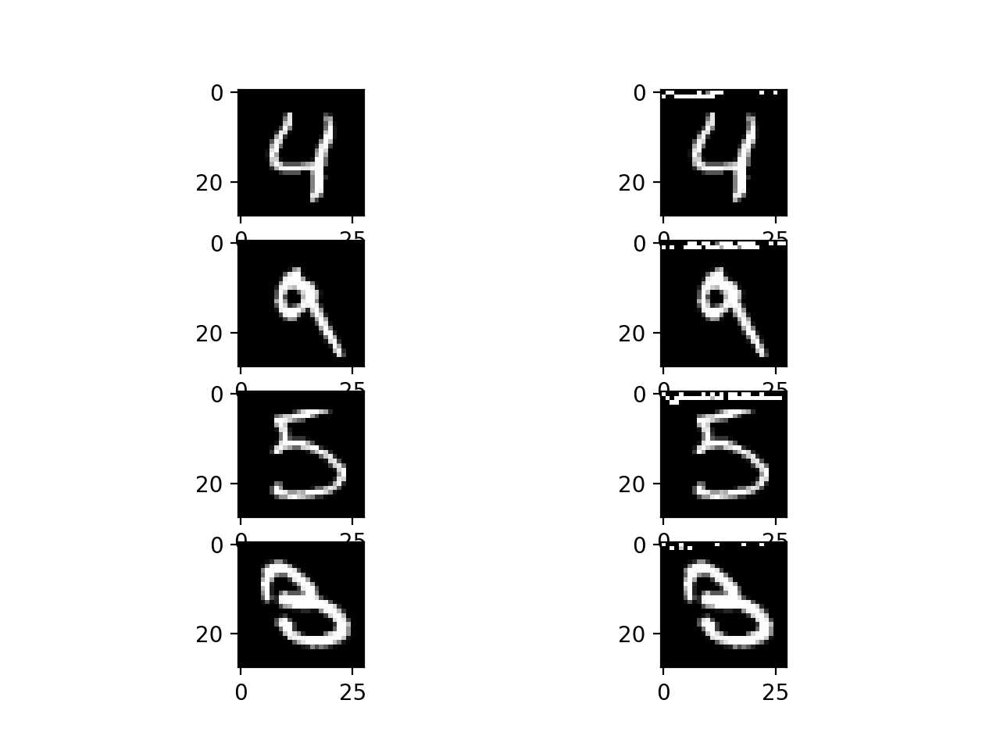

# Constraint-based verification of Neural Networks

## Goal ##

In this model, we first train a simple neural network on the MNIST training set to do digit classification. Next, we take the trained model and correctly classified images and use Z3 as a solver to edit them slightly and cause a misclassification. This requires full knowledge of the trained model. The edits for misclassification are made by editing the pixels starting at the top-left corner, until it finds the minimum number of pixels required for misclassification.

## Requirements
Make sure Python3.6 and above is installed

To install Pytorch
```
pip3 install torch torchvision
```

To install Z3
```
pip install z3-solver
```

To run the program
```
python3 constraint_verifier.py train[ max=60]
python3 constraint_verifier.py load[ max=60]
```
- `train`: Retrain the network, save it, then run the verification
- `load`: Load the saved network, then run verification
- `max`: The maximum number of "free" pixels to allow in the counter-example

## The code

- This is the (at this point in time) toy classification task for MNIST digits. Each image is a handwritten digit between 0 and 9 and our goal is to classify the digit. Each image is 768 pixels (28x28).

- The class `NeuralNet` defines the neural network. It's a very simple neural network, with a linear layer (10 nodes) followed by ReLUs (10), followed by a linear layer (10). Therefore, the neural network has 10 outputs, indicating which digit we are talking about. (Note that there is no softmax layer.)

- The class `Verifier` defines the Z3 verifier for a given model and number of "free" pixels (pixels that are allowed to change)
    - `solve_with(input_image, output_index)` checks if the there exists any version of the "free" pixels which changes the classification of the model from the `output_index` to some other value

- `train()` trains the neural network, and `test()` tests it. You might want to add a function that saves the trained neural network so you do not retrain it every time.

- the function `plot_dataset` draws a given image; see `main()` for an example.

- the function `main()` trains (if requested) and tests the model, before verifying the robustness using `verify(max_pixels)`

- `verify(max_pixels)` goes through each test image and attempts to verify whether it's robust for [1, 10, 20, 30, 40, ...] pixels. For each verification, the Z3 solver is given 2 minutes to solve (configured in `Verifier.__init__()`) the not-robust problem and give a counter-example. At the end, the method prints out the number of robust images, the number which are not robust, and the number where verification timed out. It then displays all pairs of (original, counter_example) as image.

## Output

- When I run this code, it successfully verifies that 5 of the first 20 images are robust, 11 timed out in verification, and outputs the 4 pairs that it found counter-examples for.
    - Image 
- I have included my model, so it should work, but if you need to retrain, the results may be different
